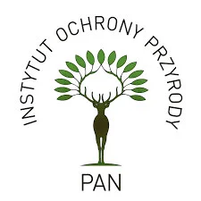
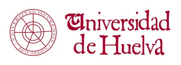
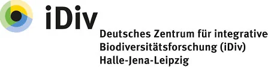

# WildIntel 🌿 🦊 🐺 🦌 🐻

**WildIntel** is an innovative platform focused on building a scalable wildlife monitoring system by integrating remote camera sampling and artificial intelligence with Essential Biodiversity Variables (EBVs).

We aim to develop a cutting-edge, coordinated wildlife monitoring system underpinned by EBVs. Our approach combines camera trapping, citizen science, and artificial intelligence to enable the automated production of species population and community structure EBVs.

Visit our official website: [https://wildintel.eu](https://wildintel.eu)

---

## 🌟 Project Goals

- **Camera Trapping**: Develop a camera-trap wildlife monitoring system across different biogeographical regions, targeting species and habitats.
- **Automatic Classification**: Contribute to the development of artificial intelligence systems applied to remote camera imagery.
- **Citizen Science**: Develop a transnational citizen science project on Zooniverse.
- **Interoperable Data**: Create a coherent and automated workflow for camera trapping and engage regional, national, and European stakeholders.
- **EBVs**: Advance the production of near real-time, automated species and community EBV datacubes.

🏛️ 🌟 Project Consortium

<table>
  <tr>
    <td align="center">
       
      Institute of Nature Conservation PAS
    </td>
    <td align="center">
       
      Institute of Nature Conservation PAS
    </td>
    <td align="center">
       
      University of South-Eastern Norway
    </td>
  </tr>

  <tr>
    <td align="center">
       
      German Centre for Integrative Biodiversity Research
    </td>
    <td align="center">
       
      Spanish National Research Council
    </td>
    <td align="center">
       
      Massachusetts Institute of Technology
    </td>
  </tr>

  <tr>
    <td align="center">
       
      Spanish Node of the Global Biodiversity Information Facility
    </td>
    <td align="center">
       
      Biodiversa +
    </td>
    <td align="center">
       
    </td>
  </tr>
</table>

----
<!--
**wildintelproject/wildintelproject** is a ✨ _special_ ✨ repository because its `README.md` (this file) appears on your GitHub profile.

Here are some ideas to get you started:

- 🔭 I’m currently working on ...
- 🌱 I’m currently learning ...
- 👯 I’m looking to collaborate on ...
- 🤔 I’m looking for help with ...
- 💬 Ask me about ...
- 📫 How to reach me: ...
- 😄 Pronouns: ...
- ⚡ Fun fact: ...
-->
